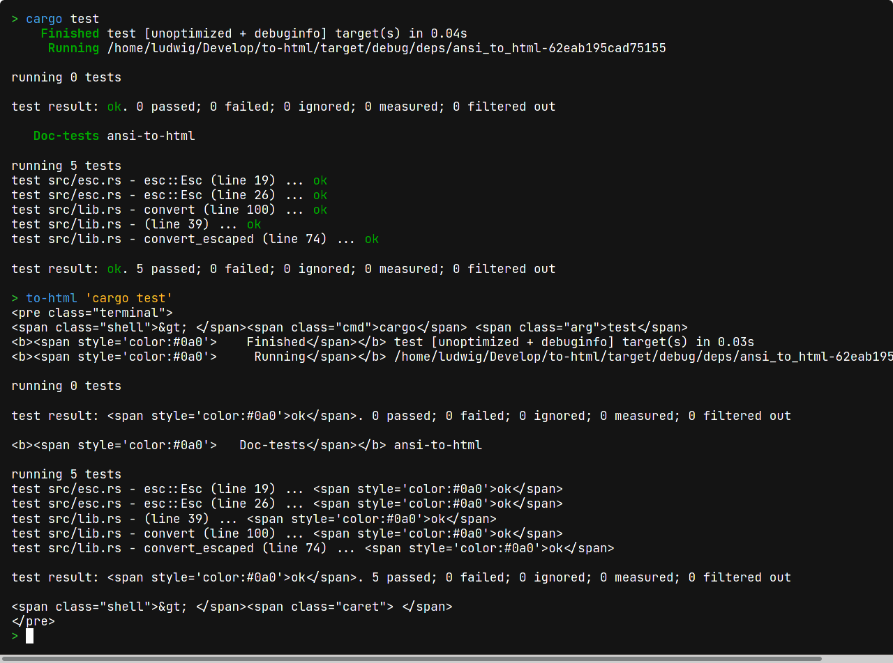

# to-html

Terminal wrapper for rendering a terminal on a website by converting ANSI escape sequences to HTML. Works with many shells, including bash, fish, ksh and zsh.

[](./LICENSE) [](https://crates.io/crates/to-html) [](https://github.com/Aloso/to-html/actions?query=workflow%3ATest)

## Changelog ☑

The changelog can be found [here](CHANGELOG.md).

## Installation 🚀

How to install colo is explained on the [releases page](https://github.com/Aloso/to-html/releases).

## Usage 📚

Execute a command:

```bash
to-html 'echo "Hello world"'
```

Execute several commands:

```bash
to-html 'echo "Hello "' 'echo world' ls
```

Commands can contain shell syntax, including pipes and redirections:

```bash
to-html "echo Hello world! | grep 'H' > somefile.txt"
```

The default shell is bash. Use `--shell`/`-s` to use a different shell:

```bash
to-html -sfish "../" "ls"   # executed with fish
```

By default, to-html emits a `<pre>` tag. Use `--doc`/`-d` to generate a whole HTML document (including CSS):

```bash
to-html -d "ls --color" > output.html
```

By default, to-html only displays an arrow (`>`) as prompt. To display the current working directory, pass `--cwd`/`-c`:

```bash
to-html -c "cd .." "ls"
```

Example output:

<pre>
~/Develop/to-html/crates $ cd ..
~/Develop/to-html $ ls
Cargo.lock  CHANGELOG.md  docs     README.md  target
Cargo.toml  crates        LICENSE  src
~/Develop/to-html $
</pre>

(colors can't be shown on GitHub)

## ANSI support 🎨

[List of supported features](https://github.com/Aloso/to-html/blob/master/crates/ansi-to-html/README.md#ansi-support)

`to-html` only supports SGR parameters (text style and colors). However, programs that overwrite their output, like for progress bars, seem to "just work". Please correct me if I'm wrong.

If you need more advanced terminal features on your website, may I suggest to use [xterm.js](https://xtermjs.org/).

## Stylesheet 💎

Include this on your website to get syntax highlighting for the prompt:

<details>
<summary>Click to expand stylesheet</summary>

```css
.terminal {
  background-color: #141414;
  overflow: auto;
  color: white;
  line-height: 120%;
}

.terminal .shell {
  color: #32d132;
  user-select: none;
  pointer-events: none;
}
.terminal .cmd {
  color: #419df3;
}
.terminal .hl {
  color: #00ffff;
  font-weight: bold;
}
.terminal .arg {
  color: white;
}
.terminal .str {
  color: #ffba24;
}
.terminal .pipe, .terminal .punct {
  color: #a2be00;
}
.terminal .flag {
  color: #ff7167;
}
.terminal .esc {
  color: #d558f5;
  font-weight: bold;
}
.terminal .caret {
  background-color: white;
  user-select: none;
}
```

</details>

## Demonstration 📸

```bash
> to-html 'cargo test' "to-html 'cargo test'"
```



## Alternatives

In the [Gnome terminal](https://help.gnome.org/users/gnome-terminal/stable/), you can define a key binding to copy terminal content as HTML.

## Code of Conduct 🤝

Please be friendly and respectful to others. This should be a place where everyone can feel safe, therefore I intend to enforce the [Rust code of conduct](https://www.rust-lang.org/policies/code-of-conduct).

## Contributing 🙌

I appreciate your help! The easiest way to help is to file bug reports or suggest new features in the [issue tracker](https://github.com/Aloso/to-html/issues).

If you want to create a pull request, make sure the following requirements are met:

* The code is documented
* If you add a dependency that includes unsafe code, please explain why it is required
* Please try to keep compile times small, if feasible

Also, to pass continuous integration, the code must

* be properly formatted with cargo fmt
* pass cargo clippy
* compile with the latest stable Rust version on Ubuntu and macOS.
* all tests must pass

That's it! If you have any questions, feel free to create an issue.
